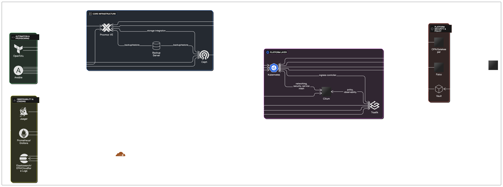

# own-cloud
Build your own bullet proof cloud.

1. **Proxmox VE (Virtualization Platform)**  
   Deploy a Proxmox cluster to provide the foundation for virtual machines and containers.

2. **Ceph (Scalable Storage)**  
   Set up Ceph and integrate with Proxmox to provide distributed, resilient storage for VMs and containers.

3. **Proxmox Backup Server (Data Backup)**  
   Install and configure Proxmox Backup Server to ensure regular backup and restore for VMs, containers, and Ceph volumes.

4. **OpenTofu (Infrastructure Provisioning)**  
   Use OpenTofu to automate the provisioning of VMs, networking, and storage resources in the Proxmox/CEPH environment.

5. **Ansible (Configuration Management)**  
   Use Ansible to configure operating systems, install base software, and harden all provisioned machines.

6. **Cloudflare (Global Load Balancing & Security)**  
   Set up Cloudflare for DNS, DDoS, WAF, global load balancing, tunnels, and Zero Trust access to your cluster endpoints.

7. **Kubernetes (Container Orchestration)**  
   Deploy Kubernetes clusters on prepared VMs, using Ceph as the persistent storage backend.

8. **Cilium (Network & Security Management / Service Mesh)**  
   Install Cilium for advanced Kubernetes networking, enforcing L3-L7 security policies, encryption, and observability (Hubble).  
   Enable Cilium Service Mesh if you do not require Istio.

9. **Traefik Enterprise (Ingress Controller & API Gateway)**  
   Deploy Traefik as the Kubernetes ingress controller for external access, API gateway features, and dynamic L7 routing.  
   Integrate with Cilium for enhanced policy and observability.

10. **OPA/Gatekeeper + Falco + Vault (Policy Enforcement, Security Monitoring & Secrets Management)**  
    - **OPA/Gatekeeper:** Enforce Kubernetes admission and compliance policies.  
    - **Falco:** Monitor runtime security and suspicious activity.  
    - **Vault:** Securely manage and inject secrets.

11. **Prometheus, Grafana & Grafana Alloy (Monitoring & Visualization)**  
    Deploy Prometheus for metrics collection and Grafana for dashboards and alerting across Kubernetes, Cilium, Traefik, etc.

12. **Elasticsearch, Filebeat & Kibana + Cloudflare Logs (Centralized Logging & Data Visualization)**  
    Aggregate and visualize logs from Kubernetes, infrastructure, Cilium Hubble, Cloudflare, and security events.

13. **Jaeger (Distributed Tracing)**  
    Deploy Jaeger for tracing microservices and integrating with Cilium, Traefik, and application workloads.

14. **Authentik (Identity & Access Management)**  
    Set up Authentik for centralized authentication and authorization across infrastructure and applications.

---

**Notes:**
- **Cilium** provides both advanced networking and service mesh features, reducing (but not eliminating) the need for Istio. Use Istio only if advanced mesh features are required.
- **Storage and backup** are provisioned before any clusters or workloads to guarantee persistence and disaster recovery.
- **Cloudflare** is set up before Kubernetes ingress to ensure security for public endpoints.
- **Observability, logging, and tracing** are installed after the core platform is operational.
